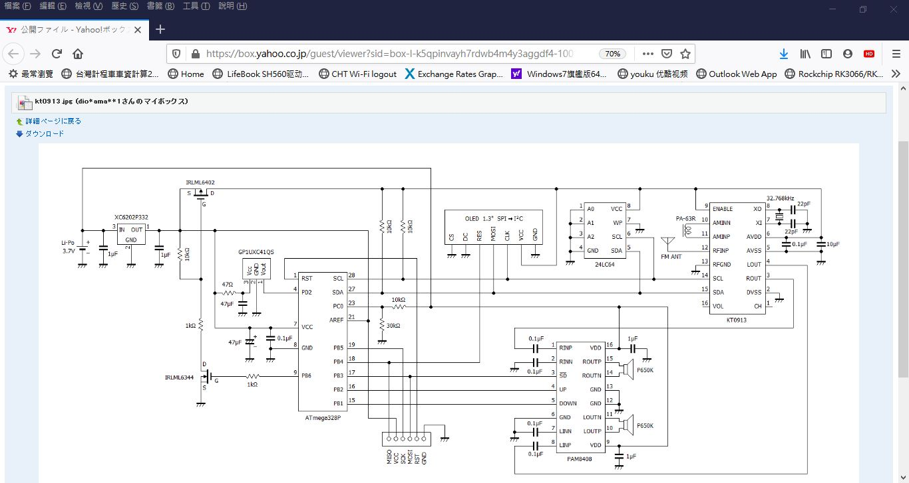
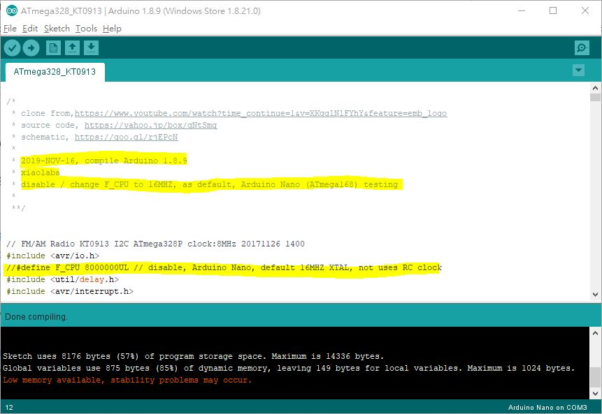

# KT0913_RADIO
KT0913 radio, atmega328 source code,   

/*  
 * clone from, https://www.youtube.com/watch?time_continue=1&v=XKgglNlFYhY&feature=emb_logo  
 * source code, https://yahoo.jp/box/gNtSmg  
 * schematic, https://goo.gl/rjEPcN   
 * 
 * 2019-NOV-16, compile, Arduino 1.8.9  
 * xiaolaba  
 * disable / change F_CPU to 16MHZ, as default, Arduino Nano (ATmega168) testing  
 * firmware image enclosed, ATmega168, 16MHZ XTAL used for testing
 *
 */  

circuit diagram
  
   
  
      
compile and result

